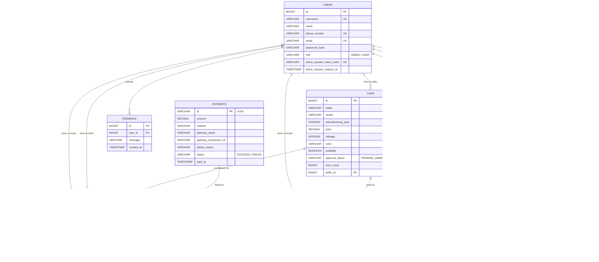

# Used Car Management — ER Diagram & DFD

---

## 1. Entity Relationship Diagram

```mermaid
erDiagram

    USERS {
        BIGINT      id              PK
        VARCHAR     username        UK
        VARCHAR     name
        VARCHAR     phone_number    UK
        VARCHAR     email           UK
        VARCHAR     password_hash
        VARCHAR     role            "ADMIN | USER"
        VARCHAR     active_session_token_hash   UK
        TIMESTAMP   active_session_expires_at
    }

    CARS {
        BIGINT      id              PK
        VARCHAR     make
        VARCHAR     model
        INTEGER     manufacturing_year
        DECIMAL     price
        INTEGER     mileage
        VARCHAR     color
        BOOLEAN     available
        VARCHAR     approval_status "PENDING_ADMIN_APPROVAL | APPROVED | REJECTED"
        BIGINT      view_count
        BIGINT      seller_id       FK
    }

    PAYMENTS {
        VARCHAR     id              PK  "UUID"
        DECIMAL     amount
        VARCHAR     method
        VARCHAR     gateway_name
        VARCHAR     gateway_transaction_id
        VARCHAR     failure_reason
        VARCHAR     status          "SUCCESS | FAILED"
        TIMESTAMP   paid_at
    }

    PURCHASE_ORDERS {
        BIGINT      id              PK
        BIGINT      buyer_id        FK
        BIGINT      seller_id       FK
        BIGINT      car_id          FK
        VARCHAR     payment_id      FK
        VARCHAR     status          "PENDING_ADMIN_APPROVAL | PENDING_SELLER_APPROVAL | APPROVED | REJECTED | CANCELLED"
        BOOLEAN     fraud_alert
        TIMESTAMP   created_at
    }

    WISHLIST_ITEMS {
        BIGINT      id              PK
        BIGINT      buyer_id        FK
        BIGINT      car_id          FK
        TIMESTAMP   added_at
    }

    FEEDBACK {
        BIGINT      id              PK
        BIGINT      user_id         FK
        VARCHAR     message
        TIMESTAMP   created_at
    }

    SUPPORT_TICKETS {
        BIGINT      id              PK
        BIGINT      buyer_id        FK
        VARCHAR     subject
        VARCHAR     description
        VARCHAR     status          "OPEN | CLOSED"
        TIMESTAMP   created_at
    }

    TICKET_RESPONSES {
        BIGINT      id              PK
        BIGINT      ticket_id       FK
        BIGINT      sender_id       FK
        VARCHAR     message
        TIMESTAMP   responded_at
    }

    RECENT_VIEWS {
        BIGINT      id              PK
        BIGINT      user_id         FK
        BIGINT      car_id          FK
        VARCHAR     session_token_hash
        TIMESTAMP   viewed_at
    }

    USERS ||--o{ CARS             : "lists as seller"
    USERS ||--o{ PURCHASE_ORDERS  : "buys as buyer"
    USERS ||--o{ PURCHASE_ORDERS  : "sells as seller"
    USERS ||--o{ WISHLIST_ITEMS   : "saves as buyer"
    USERS ||--o{ FEEDBACK         : "submits"
    USERS ||--o{ SUPPORT_TICKETS  : "raises"
    USERS ||--o{ TICKET_RESPONSES : "sends"
    USERS ||--o{ RECENT_VIEWS     : "views"

    CARS ||--o{ PURCHASE_ORDERS   : "purchased via"
    CARS ||--o{ WISHLIST_ITEMS    : "saved in"
    CARS ||--o{ RECENT_VIEWS      : "viewed in"

    PAYMENTS ||--|| PURCHASE_ORDERS : "linked to"

    SUPPORT_TICKETS ||--o{ TICKET_RESPONSES : "has replies"
```

---

## 2. Data Flow Diagram (Level 1)

```mermaid
flowchart TD

    %% External Entities
    GUEST([Guest / Browser])
    ADMIN_USER([Admin User])
    USER_ACTOR([Registered User])
    EMAIL_SVC([Email Server\nSMTP])
    PAY_GW([Payment Gateway\nSimulated])

    %% Processes
    P1[1. Authentication\nRegister / Login / Logout]
    P2[2. Car Listing\nAdd / Edit / Delete / Browse]
    P3[3. Admin Approval\nCars & Orders]
    P4[4. Purchase Flow\nPayment + Order Creation]
    P5[5. Order Management\nApprove / Reject by Seller]
    P6[6. Wishlist\nAdd / View / Remove]
    P7[7. Recent Views\nTrack + Retrieve]
    P8[8. Feedback\nSubmit / Admin View]
    P9[9. Support Tickets\nCreate / Chat / Close]
    P10[10. Dashboards\nSeller + Admin Stats]

    %% Data Stores
    DS1[(USERS)]
    DS2[(CARS)]
    DS3[(PURCHASE_ORDERS)]
    DS4[(PAYMENTS)]
    DS5[(WISHLIST_ITEMS)]
    DS6[(RECENT_VIEWS)]
    DS7[(FEEDBACK)]
    DS8[(SUPPORT_TICKETS)]
    DS9[(TICKET_RESPONSES)]

    %% Auth Flow
    GUEST -- "credentials / register data" --> P1
    P1 -- "session token + role" --> GUEST
    P1 -- "read/write user record" --> DS1

    %% Car Listing Flow
    USER_ACTOR -- "car details + session token" --> P2
    P2 -- "save / update / delete car" --> DS2
    P2 -- "car list / details" --> USER_ACTOR

    %% Admin Approval Flow
    ADMIN_USER -- "approve/reject + session token" --> P3
    P3 -- "update approval status" --> DS2
    P3 -- "update order status" --> DS3

    %% Purchase Flow
    USER_ACTOR -- "carId + payment token + session" --> P4
    P4 -- "process payment" --> PAY_GW
    PAY_GW -- "success / failure" --> P4
    P4 -- "write payment record" --> DS4
    P4 -- "write order record" --> DS3
    P4 -- "mark car unavailable" --> DS2
    P4 -- "notify seller + admin" --> EMAIL_SVC

    %% Order Management by Seller
    USER_ACTOR -- "approve/reject sale + session" --> P5
    P5 -- "update order status" --> DS3
    P5 -- "mark car sold" --> DS2

    %% Wishlist
    USER_ACTOR -- "carId + session" --> P6
    P6 -- "read/write wishlist" --> DS5
    P6 -- "wishlist items" --> USER_ACTOR

    %% Recent Views
    USER_ACTOR -- "view car + session" --> P7
    P7 -- "write view record (hashed token)" --> DS6
    P7 -- "increment view count" --> DS2
    P7 -- "recent 10 views" --> USER_ACTOR

    %% Feedback
    USER_ACTOR -- "feedback message + session" --> P8
    P8 -- "write feedback" --> DS7
    ADMIN_USER -- "read all feedback + session" --> P8
    P8 -- "feedback list" --> ADMIN_USER

    %% Support Tickets
    USER_ACTOR -- "ticket / message + session" --> P9
    ADMIN_USER -- "reply / close + session" --> P9
    P9 -- "read/write tickets" --> DS8
    P9 -- "read/write responses" --> DS9
    P9 -- "ticket + chat history" --> USER_ACTOR
    P9 -- "all tickets" --> ADMIN_USER

    %% Dashboards
    USER_ACTOR -- "session token" --> P10
    ADMIN_USER -- "session token" --> P10
    P10 -- "read counts from" --> DS1
    P10 -- "read counts from" --> DS2
    P10 -- "read counts from" --> DS3
    P10 -- "read counts from" --> DS8
    P10 -- "stats summary" --> USER_ACTOR
    P10 -- "full admin stats" --> ADMIN_USER

    %% Email notifications
    P1 -- "registration email" --> EMAIL_SVC

    %% Styling
    classDef entity  fill:#4A90D9,stroke:#2c6fad,color:#fff
    classDef process fill:#F5A623,stroke:#c4841a,color:#000
    classDef store   fill:#7ED321,stroke:#5a9a18,color:#000
    classDef ext     fill:#9B59B6,stroke:#7d3f9a,color:#fff

    class GUEST,ADMIN_USER,USER_ACTOR entity
    class EMAIL_SVC,PAY_GW ext
    class P1,P2,P3,P4,P5,P6,P7,P8,P9,P10 process
    class DS1,DS2,DS3,DS4,DS5,DS6,DS7,DS8,DS9 store
```
