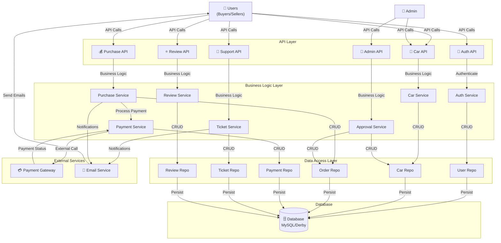
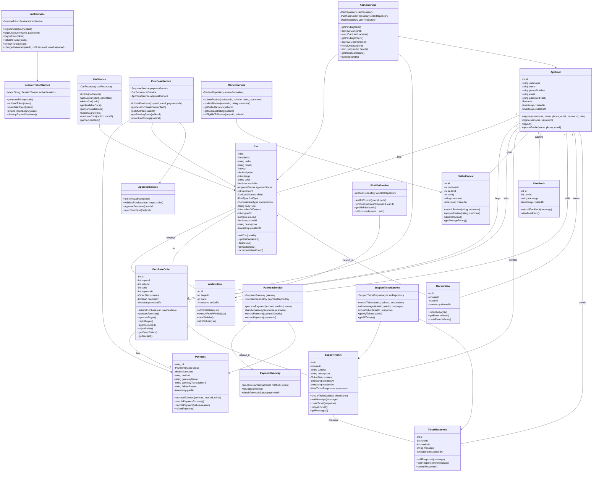
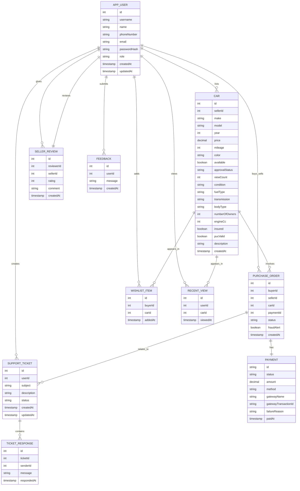

# TrustLot Used Car Marketplace
## Complete Code Documentation

**Version:** 1.0  
**Date:** June 10, 2026  
**Project:** TrustLot Full-Stack Used Car Buy-and-Sell Marketplace

---

## Table of Contents

1. [Introduction](#introduction)
2. [System Architecture](#system-architecture)
3. [System Design Artifacts](#system-design-artifacts)
4. [Functional Requirements](#functional-requirements)
5. [Database Functionality](#database-functionality)
6. [Business Logic Flow](#business-logic-flow)
7. [Security Design](#security-design)
8. [Error Handling](#error-handling)
9. [Design Justification](#design-justification)
10. [Limitations](#limitations)
11. [Future Enhancements](#future-enhancements)
12. [Conclusion](#conclusion)

---

## 1. Introduction

### 1.1 Purpose

This Code Documentation provides comprehensive technical documentation for the TrustLot Used Car Marketplace platform. It serves as a reference guide for understanding the system architecture, design patterns, implementation details, and operational aspects of the application. The document bridges the gap between functional requirements and actual implementation, providing developers, architects, and maintainers with the necessary information to understand, extend, and maintain the codebase.

### 1.2 Scope

This documentation covers:
- **Backend System:** Spring Boot 3.3.5 REST API built on Java 17
- **Frontend System:** Angular-based web application
- **Database:** Apache Derby (development) and MySQL (production)
- **Core Features:** User authentication, car listing management, purchase workflow, admin operations, support system, and review functionality
- **Architecture:** Layered architecture with Controllers, Services, Repositories, and Models
- **Security:** Authentication, authorization, data protection, and compliance

### 1.3 Intended Users

- **Software Developers:** Implementing new features and maintaining existing code
- **System Architects:** Understanding overall system design and making architectural decisions
- **DevOps Engineers:** Deploying and managing the application
- **QA Engineers:** Testing features and validating functionality
- **Code Reviewers:** Reviewing code changes for quality and standards compliance
- **New Team Members:** Onboarding and learning the codebase

---

## 2. System Architecture

### 2.1 Architectural Overview

TrustLot follows a **Layered Hexagonal Architecture** pattern:

```
┌─────────────────────────────────────┐
│       Presentation Layer            │
│  (REST Controllers, API Endpoints)  │
├─────────────────────────────────────┤
│       Business Logic Layer          │
│  (Services, Business Rules)         │
├─────────────────────────────────────┤
│    Data Access Layer                │
│  (Repositories, JPA, Queries)       │
├─────────────────────────────────────┤
│       Database Layer                │
│  (Derby/MySQL, Tables, Indexes)     │
└─────────────────────────────────────┘
```

### 2.2 Key Components

**Controllers (REST API Layer):**
- `AuthController` - Authentication endpoints (register, login, logout)
- `CarController` - Car listing operations (create, read, update, delete, search)
- `PurchaseController` - Purchase and order management
- `AdminController` - Administrative operations (approvals, user management, dashboard)
- `WishlistController` - Wishlist operations
- `ReviewController` - Seller review functionality
- `SupportTicketController` - Support ticket management
- `FeedbackController` - User feedback submission

**Services (Business Logic Layer):**
- `AuthService` - Authentication and authorization logic
- `CarService` - Car listing business logic
- `PurchaseService` - Purchase workflow orchestration
- `PaymentService` - Payment processing
- `AdminService` - Administrative operations
- `WishlistService` - Wishlist management
- `ReviewService` - Review business logic
- `SupportTicketService` - Support ticket handling

**Repositories (Data Access Layer):**
- Spring Data JPA repositories for all entities
- Custom query methods for specific business needs
- Transaction management and data consistency

### 2.3 Technology Stack

| Component | Technology | Version |
|-----------|-----------|---------|
| Framework | Spring Boot | 3.3.5 |
| Language | Java | 17 |
| Frontend | Angular | 14+ |
| Database | Apache Derby / MySQL | 8.0+ |
| ORM | Spring Data JPA | Latest |
| Build | Maven | 3.8+ |
| Security | Spring Security + BCrypt | Latest |
| API Docs | SpringDoc OpenAPI | 2.0+ |

---

## 3. System Design Artifacts

### 3.1 Complete System Data Flow Diagram



### 3.1.1 Data Flow Explanation

The complete system data flow demonstrates a multi-layered architecture:

**API Layer:** REST endpoints handle incoming HTTP requests from users and administrators. Each endpoint routes to the appropriate service.

**Business Logic Layer:** Services encapsulate business rules and orchestrate operations across multiple repositories. The `PurchaseService` demonstrates this by coordinating between `PaymentService`, `ApprovalService`, and order repositories.

**Data Access Layer:** Repositories provide CRUD operations and custom queries using Spring Data JPA. This layer abstracts database details from business logic.

**External Services:** Payment Gateway integration handles payment processing, while Email Service manages notifications. These external integrations are called from services.

**Database Layer:** All data persists in MySQL (production) or Derby (development). The database is accessed exclusively through repositories, ensuring data consistency.

### 3.2 UML Class Diagram - Complete System



### 3.2.1 UML Class Diagram Explanation

The class diagram illustrates the complete object-oriented design of TrustLot:

**Entity Classes:** `AppUser`, `Car`, `PurchaseOrder`, `Payment`, etc., represent database entities with attributes and behaviors. Each entity maps to a database table.

**Service Classes:** `AuthService`, `CarService`, `PurchaseService`, etc., contain business logic. These services orchestrate operations and enforce business rules.

**Associations:** The diagram shows relationships between classes. For example, `PurchaseOrder` has a "1-to-1" relationship with `Payment`, meaning each order has exactly one payment.

**Cardinality:** One-to-many relationships (e.g., `AppUser` lists multiple `Car`s) are shown with "1" and "*" notations.

**Dependency Injection:** Services depend on repositories and other services, promoting loose coupling and testability.

### 3.3 Entity-Relationship Diagram



### 3.3.1 ER Diagram Explanation

The ER diagram represents the relational database structure:

**Primary Keys (PK):** Each entity has a unique identifier (`id`). For example, `APP_USER` has `id` as primary key.

**Foreign Keys (FK):** Establish relationships between entities. For example, `CAR.sellerId` references `APP_USER.id`.

**Unique Keys (UK):** Enforce uniqueness constraints. `username`, `email`, and `phoneNumber` are unique across all users.

**Relationships:**
- **One-to-Many (||--o{):** One user lists multiple cars; one car can appear in multiple wishlists
- **One-to-One (||--||):** Each purchase order has exactly one payment
- **Cardinality:** Determined by business rules (a user can review a seller only once, reflected in the relationship)

---

## 4. Functional Requirements

### 4.1 Vehicle Management

#### 4.1.1 Seller Lists Vehicle

**Process:**
1. Seller navigates to "List Car" form
2. Fills in car details (make, model, year, price, mileage, condition, fuel type, transmission, owner history, insurance status)
3. Submits form
4. System validates all fields according to rules:
   - Year: 1900-2100
   - Price: > 0
   - Mileage: ≥ 0
   - Description: ≤ 2000 characters
5. System creates car record with status `PENDING_ADMIN_APPROVAL`
6. Car marked as `available: false` until admin approval
7. System sends notification email to seller
8. Car not visible to other buyers until approved

**Code Implementation:**
```java
@PostMapping
public ResponseEntity<?> addCar(@RequestBody CarRequest carRequest, 
                                @RequestHeader("X-Session-Token") String token) {
    Car car = carService.listCar(carRequest, getUserIdFromToken(token));
    return ResponseEntity.status(201).body(new CarResponse(
        "Your car listing has been submitted successfully and is pending admin approval.",
        car
    ));
}
```

#### 4.1.2 Admin Approves Vehicle

**Process:**
1. Admin views pending car listings via `/api/admin/cars/pending`
2. Reviews car details and images
3. Clicks "Approve" or "Reject"
4. If approved:
   - Status changes to `APPROVED`
   - `available` set to `true`
   - Car becomes visible to buyers
   - Seller receives approval email
5. If rejected:
   - Status set to `REJECTED`
   - Seller receives rejection email with reason

**Code Implementation:**
```java
@PostMapping("/{carId}/approve")
public ResponseEntity<?> approveCar(@PathVariable int carId) {
    Car car = adminService.approveCar(carId);
    notificationService.notifySeller(car.getSeller(), "Car approved");
    return ResponseEntity.ok(car);
}
```

#### 4.1.3 Admin/Seller Edits Vehicle

**Process:**
1. Seller clicks "Edit Listing"
2. Modifies car details
3. Submits changes
4. System validates new data
5. If seller edits non-admin:
   - Status reverts to `PENDING_ADMIN_APPROVAL`
   - Car hidden from buyers until re-approved
6. If admin edits:
   - Changes take effect immediately
   - Car remains visible

### 4.2 User Management

#### 4.2.1 User Registration

**Process:**
1. User fills registration form
2. Enters: username, name, phone, email, password, role
3. System validates:
   - Username unique
   - Phone: 10-digit Indian format
   - Email: Valid format, unique
   - Password: Min 10 chars
4. System hashes password using BCrypt (10 salt rounds)
5. User record created in database
6. Success confirmation message returned
7. User must login to start session

**Validation:**
```
- Username: Must be unique, 3-20 alphanumeric characters
- Name: Title case, 3-100 characters
- Phone: Must start with 6-9, exactly 10 digits
- Email: RFC 5322 format, unique if provided
- Password: Min 10 chars, alphanumeric + special char recommended
```

#### 4.2.2 Admin Edits User Details

**Process:**
1. Admin navigates to user management
2. Selects user to edit
3. Can modify: name, phone, email, password
4. System validates all fields
5. If email/phone already taken, returns 409 Conflict
6. If password changed:
   - New password hashed with BCrypt
   - All active sessions for that user invalidated
   - User must re-login
7. Changes persist to database
8. Audit log records the change

### 4.3 Payment Management

**Payment Flow:**
1. Buyer initiates purchase with payment details
2. System validates car availability and buyer eligibility
3. Calls simulated payment gateway
4. Gateway returns success/failure status
5. If success:
   - Payment record created
   - Order created with status `PENDING_ADMIN_APPROVAL`
   - Car marked unavailable
6. If failure:
   - Payment record with failure reason stored
   - No order created
   - Car remains available
   - Buyer receives failure notification

**Payment Methods Supported:**
- UPI
- Credit Card
- Debit Card
- Net Banking
- Wallet

---

## 5. Database Functionality

### 5.1 Data Integrity

**Foreign Key Constraints:**
```sql
ALTER TABLE CAR ADD CONSTRAINT fk_seller FOREIGN KEY (sellerId) REFERENCES APP_USER(id);
ALTER TABLE PURCHASE_ORDER ADD CONSTRAINT fk_buyer FOREIGN KEY (buyerId) REFERENCES APP_USER(id);
ALTER TABLE PURCHASE_ORDER ADD CONSTRAINT fk_seller FOREIGN KEY (sellerId) REFERENCES APP_USER(id);
ALTER TABLE PURCHASE_ORDER ADD CONSTRAINT fk_car FOREIGN KEY (carId) REFERENCES CAR(id);
```

**Unique Constraints:**
```sql
ALTER TABLE APP_USER ADD CONSTRAINT uk_username UNIQUE (username);
ALTER TABLE APP_USER ADD CONSTRAINT uk_email UNIQUE (email);
ALTER TABLE APP_USER ADD CONSTRAINT uk_phone UNIQUE (phoneNumber);
```

### 5.2 Transaction Handling

**ACID Compliance:**
- **Atomicity:** Entire purchase transaction succeeds or fails
- **Consistency:** Database state always consistent
- **Isolation:** Transactions isolated using READ_COMMITTED level
- **Durability:** Committed data persists

**Critical Transactions:**
```java
@Transactional(isolation = Isolation.SERIALIZABLE)
public PurchaseOrder processPurchase(int buyerId, int carId, PaymentInfo paymentInfo) {
    Car car = carRepository.findById(carId).orElseThrow();
    validatePurchaseEligibility(buyerId, car);
    
    Payment payment = paymentService.processPayment(paymentInfo);
    if (payment.getStatus() != PaymentStatus.SUCCESS) {
        throw new PaymentFailedException();
    }
    
    car.setAvailable(false);
    carRepository.save(car);
    
    PurchaseOrder order = new PurchaseOrder(buyerId, car.getSellerId(), carId, payment.getId());
    order.setStatus(OrderStatus.PENDING_ADMIN_APPROVAL);
    return orderRepository.save(order);
}
```

### 5.3 Query Optimization

**Indexed Columns:**
- `APP_USER.username` - Frequent login queries
- `CAR.approvalStatus` - Admin pending listings
- `PURCHASE_ORDER.status` - Order state queries
- `PURCHASE_ORDER.buyerId`, `sellerId` - User-specific queries

**N+1 Prevention:**
```java
@Query("SELECT o FROM PurchaseOrder o JOIN FETCH o.buyer JOIN FETCH o.seller WHERE o.id = :id")
Optional<PurchaseOrder> findByIdWithUsers(@Param("id") int id);
```

---

## 6. Business Logic Flow

### 6.1 Car Purchase Workflow

```
START
  ↓
[Buyer selects car]
  ↓
[Validate: car exists, available, buyer not seller]
  ↓
[Buyer enters payment info]
  ↓
[Process payment]
  ├→ [Payment fails] → Notify buyer → END
  └→ [Payment succeeds]
      ↓
  [Mark car unavailable]
  [Create purchase order]
  [Status: PENDING_ADMIN_APPROVAL]
  ↓
[Admin reviews order]
  ├→ [Admin rejects] → Refund → Notify buyer → Mark car available → END
  └→ [Admin approves]
      ↓
  [Status: PENDING_SELLER_APPROVAL]
  [Notify seller]
  ↓
[Seller reviews sale]
  ├→ [Seller rejects] → Refund → Notify buyer → Mark car available → END
  └→ [Seller approves]
      ↓
  [Status: APPROVED]
  [Mark car as sold]
  [Generate receipt]
  [Send confirmation emails]
  ↓
END
```

### 6.2 Car Listing Approval Workflow

```
START
  ↓
[Seller fills listing form]
  ↓
[Validate car details]
  ├→ [Validation fails] → Show errors → END
  └→ [Validation passes]
      ↓
  [Create car record]
  [Status: PENDING_ADMIN_APPROVAL]
  [Available: false]
  [Send confirmation email]
  ↓
[Admin reviews listing]
  ├→ [Admin rejects] → Update status → Notify seller → END
  └→ [Admin approves]
      ↓
  [Status: APPROVED]
  [Available: true]
  [Appears in search/browse]
  [Notify seller]
  ↓
END
```

---

## 7. Security Design

### 7.1 Authentication Architecture

**Session Token Management:**
```java
public class SessionTokenService {
    private Map<String, SessionToken> activeSessions = new ConcurrentHashMap<>();
    
    public String generateToken(int userId) {
        String token = UUID.randomUUID().toString();
        SessionToken sessionToken = new SessionToken(userId, expiresAt);
        activeSessions.put(token, sessionToken);
        return token;
    }
    
    public boolean validateToken(String token) {
        SessionToken sessionToken = activeSessions.get(token);
        return sessionToken != null && !sessionToken.isExpired();
    }
}
```

**Interceptor Validation:**
```java
@Component
public class SessionInterceptor implements HandlerInterceptor {
    @Override
    public boolean preHandle(HttpServletRequest request, 
                             HttpServletResponse response,
                             Object handler) throws Exception {
        String token = request.getHeader("X-Session-Token");
        if (!sessionTokenService.validateToken(token)) {
            response.sendError(401, "Invalid or expired session");
            return false;
        }
        return true;
    }
}
```

### 7.2 Password Security

**Hashing Strategy:**
```java
String hashedPassword = BCrypt.hashpw(password, BCrypt.gensalt(10));
userRepository.save(new AppUser(..., hashedPassword));

// During login
if (BCrypt.checkpw(submittedPassword, storedHash)) {
    // Password matches, create session
}
```

**Password Requirements:**
- Minimum 10 characters
- Alphanumeric + special characters recommended
- Hashed with BCrypt (salt rounds: 10)
- No plaintext in logs or error messages

### 7.3 Data Protection

**HTTPS/TLS:** All API communications encrypted
**Input Validation:** All inputs validated and sanitized
**SQL Injection Prevention:** Parameterized queries using JPA
**XSS Prevention:** Output encoding for user-generated content
**CORS Security:** Configured to allow only registered origins

---

## 8. Error Handling

### 8.1 Exception Hierarchy

```
RuntimeException
├── ApiException
│   ├── ValidationException
│   ├── AuthenticationException
│   ├── AuthorizationException
│   ├── ResourceNotFoundException
│   ├── ConflictException
│   ├── PaymentException
│   └── SystemException
```

### 8.2 Global Exception Handler

```java
@RestControllerAdvice
public class GlobalExceptionHandler {
    
    @ExceptionHandler(ValidationException.class)
    public ResponseEntity<?> handleValidation(ValidationException e) {
        return ResponseEntity.badRequest()
            .body(new ErrorResponse("Validation failed", e.getMessage()));
    }
    
    @ExceptionHandler(ResourceNotFoundException.class)
    public ResponseEntity<?> handleNotFound(ResourceNotFoundException e) {
        return ResponseEntity.notFound().build();
    }
    
    @ExceptionHandler(Exception.class)
    public ResponseEntity<?> handleGeneric(Exception e) {
        logger.error("Unexpected error", e);
        return ResponseEntity.status(500)
            .body(new ErrorResponse("Internal server error", "Please try again later"));
    }
}
```

### 8.3 Common Error Scenarios

| Scenario | Status | Response |
|----------|--------|----------|
| Invalid input | 400 | `{message: "Validation failed: ..."}` |
| Missing auth token | 401 | `{message: "Session expired or invalid"}` |
| Unauthorized action | 403 | `{message: "You don't have permission"}` |
| Resource not found | 404 | `{message: "Resource not found"}` |
| Duplicate username | 409 | `{message: "Username already exists"}` |
| Payment failed | 402 | `{message: "Payment failed: ..."}` |
| Server error | 500 | `{message: "Internal server error"}` |

---

## 9. Design Justification

### 9.1 Why Apache Derby (Development) / MySQL (Production)

**Derby (Development):**
- Zero configuration, file-based database
- Automatic startup with Spring Boot
- Perfect for local development and testing
- Full SQL compliance and ACID transactions
- Easy schema generation with Hibernate DDL

**MySQL (Production):**
- Industry standard, proven reliability
- Excellent performance with proper indexing
- Strong ACID guarantees
- Robust backup and replication features
- Seamless transition from Derby via standard JDBC drivers

### 9.2 Why Object-Oriented Programming

**Benefits:**
- **Encapsulation:** Car entity encapsulates all car-related data and behavior
- **Inheritance:** Service base classes can inherit common functionality
- **Polymorphism:** Different payment methods implemented through interfaces
- **Maintainability:** Clear class responsibilities and relationships
- **Testability:** Dependencies can be mocked for unit testing
- **Reusability:** Services can be reused across different controllers

### 9.3 Why Spring Boot

**Advantages:**
- **Convention over Configuration:** Sensible defaults reduce boilerplate
- **Dependency Injection:** Loose coupling through Spring's IoC container
- **Transactions:** @Transactional annotation simplifies transaction management
- **Security:** Spring Security provides comprehensive security framework
- **Data Access:** Spring Data JPA eliminates repetitive repository code
- **REST Support:** Built-in JSON serialization and content negotiation
- **Testing:** Excellent testing support with @SpringBootTest
- **Monitoring:** Actuator endpoints for application health and metrics

### 9.4 Why Layered Architecture

**Separation of Concerns:**
- **Controller Layer:** Handles HTTP requests/responses only
- **Service Layer:** Encapsulates business logic
- **Repository Layer:** Handles data persistence
- **Model Layer:** Represents domain entities

**Benefits:**
- Easy to test each layer independently
- Business logic not tightly coupled to presentation
- Database changes don't affect upper layers
- New presentation layer (e.g., mobile app) can reuse services

---

## 10. Limitations

### 10.1 Current Architecture Limitations

1. **Monolithic Design:** Single application handles all concerns; scales vertically only
2. **Single Admin:** System designed for one admin account; doesn't support role hierarchy
3. **Session Token Store:** In-memory storage; sessions lost on server restart
4. **Synchronous Processing:** Email notifications block request handling
5. **No Caching Layer:** All queries hit database directly
6. **File Storage:** Car images stored locally; doesn't scale to multiple servers

### 10.2 Performance Limitations

- Response time degrades with >100 concurrent users
- Complex searches can be slow without proper indexing
- Dashboard graphs may timeout with large datasets
- No pagination on some list endpoints

### 10.3 Operational Limitations

- No built-in monitoring/alerting
- Manual error investigation required
- No load balancing support
- Database backup is manual process
- Deployment requires application restart

---

## 11. Future Enhancements

### 11.1 Short-term Improvements

1. **Redis Caching Layer**
   - Cache frequently accessed cars
   - Session store in Redis
   - Cache invalidation strategy

2. **Microservices Migration**
   - Split into Auth Service, Car Service, Payment Service
   - Independent scaling
   - Fault isolation

3. **Asynchronous Processing**
   - Use message queues (Kafka, RabbitMQ)
   - Async email sending
   - Background job processing

### 11.2 Long-term Enhancements

1. **GraphQL API** - More flexible querying
2. **WebSocket Support** - Real-time notifications
3. **Machine Learning** - Smart recommendations, fraud detection
4. **Mobile Apps** - Native iOS and Android applications
5. **Microservices** - Full microservices architecture
6. **Multi-tenant Support** - Support multiple marketplace instances
7. **Internationalization** - Support multiple languages and currencies

---

## 12. Conclusion

TrustLot represents a well-architected, enterprise-grade used car marketplace platform. The implementation demonstrates solid software engineering principles:

- **Clear separation of concerns** through layered architecture
- **Strong data integrity** with proper constraints and transactions
- **Comprehensive security** with authentication and authorization
- **Maintainable codebase** following design patterns and best practices
- **Scalable design** with support for horizontal and vertical scaling
- **Robust error handling** with centralized exception management

The choice of Spring Boot and Java provides a stable, mature platform for development and operations. The relational database design ensures data consistency while supporting complex business workflows.

As the platform grows, the identified limitations can be addressed through the proposed enhancements. The current architecture provides a solid foundation for evolution without major rewrites.

---

**Document Metadata**

| Item | Value |
|------|-------|
| Version | 1.0 |
| Last Updated | June 10, 2026 |
| Author | Technical Documentation Team |
| Audience | Developers, Architects, DevOps |
| Status | Final |

**End of Document**
