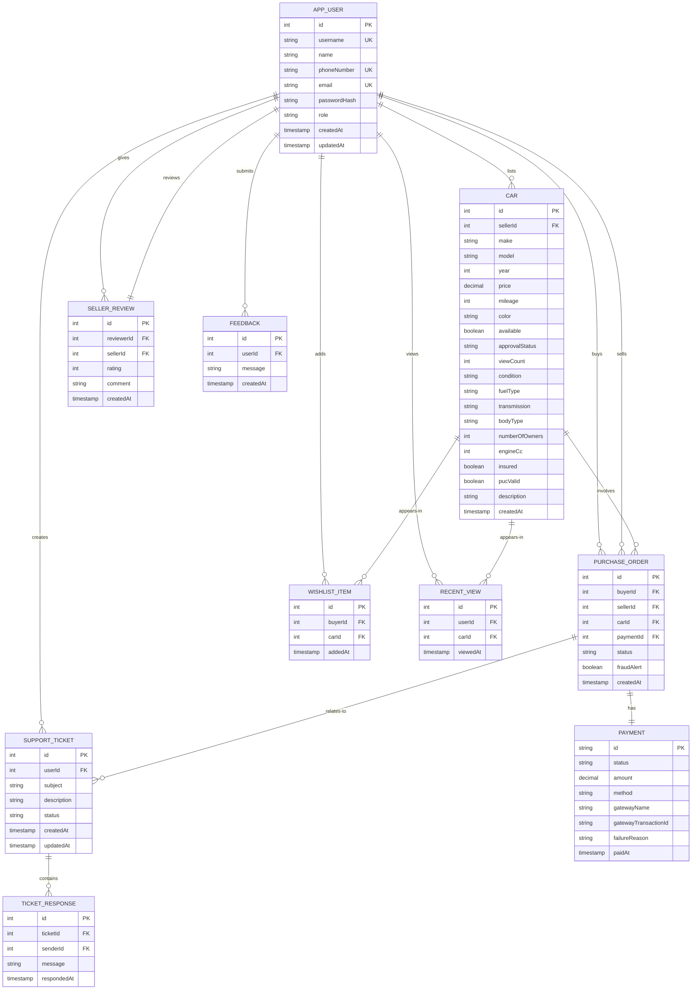
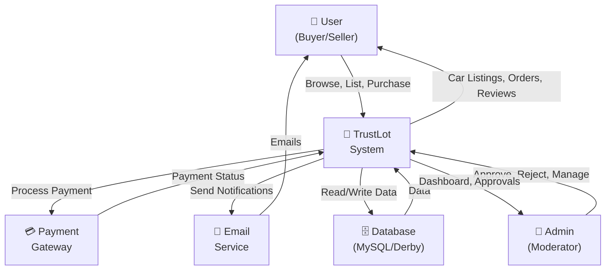
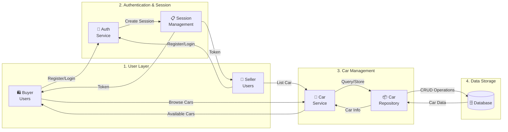
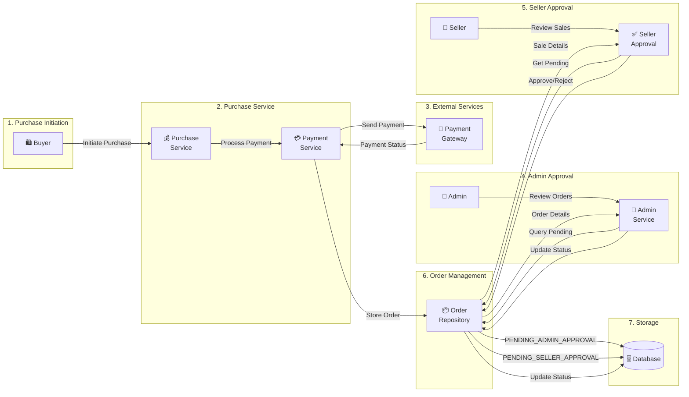
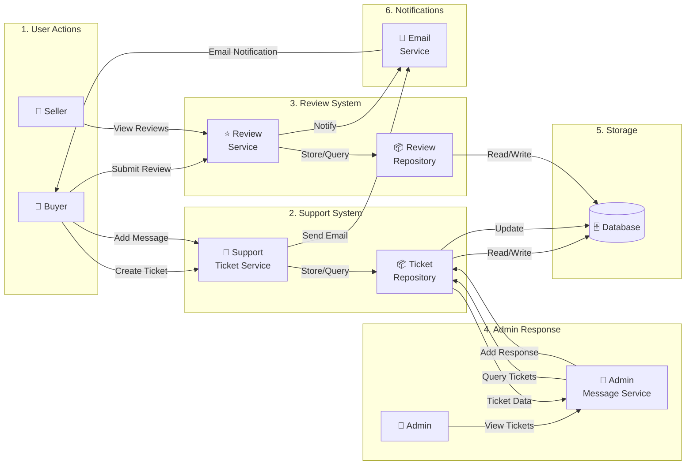
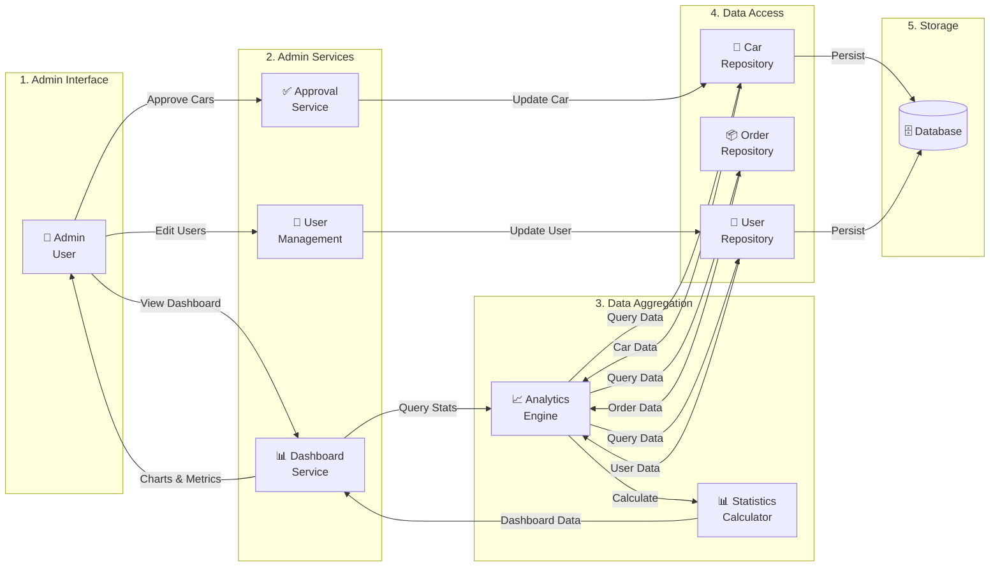
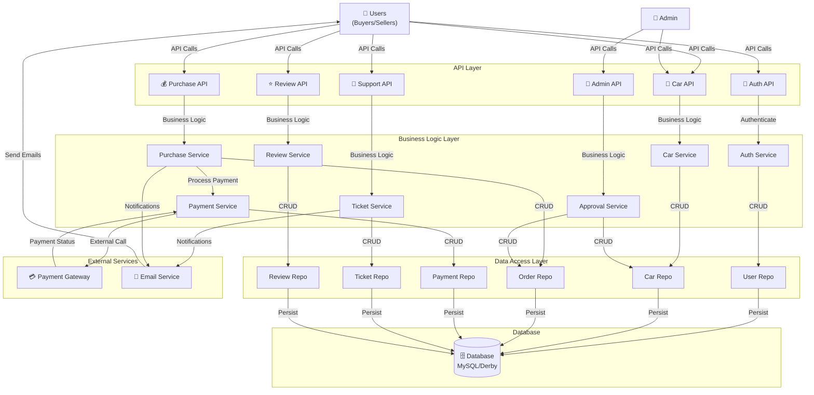

# TrustLot System Diagrams

## 1. Entity-Relationship (ER) Diagram

---

## 2. Data Flow Diagram (DFD) - Level 0

---

## 3. Data Flow Diagram (DFD) - Level 1: User & Car Management

---

## 4. Data Flow Diagram (DFD) - Level 1: Purchase & Payment

---

## 5. Data Flow Diagram (DFD) - Level 1: Support & Reviews

---

## 6. Data Flow Diagram (DFD) - Level 1: Admin Dashboard

---

## 7. Complete System Data Flow

---

## Diagram Descriptions

### ER Diagram
- **Entities:** 10 main entities (AppUser, Car, PurchaseOrder, Payment, etc.)
- **Relationships:** One-to-many (user lists cars), Many-to-one (purchase involves car), One-to-one (order has payment)
- **Keys:** Primary keys (id), Foreign keys (FK), Unique keys (UK) marked
- **Attributes:** All important fields including timestamps and status fields

### DFD Level 0
- **Context Diagram:** Shows system boundary with external actors
- **External Entities:** Users, Admin, Payment Gateway, Email Service
- **System:** Central TrustLot system processing all transactions

### DFD Level 1 - User & Car Management
- **Authentication Flow:** User registration → Auth Service → Session Management
- **Car Management:** Listing cars, browsing cars → Car Service → Database

### DFD Level 1 - Purchase & Payment
- **Purchase Workflow:** Buyer initiates → Payment processing → Admin approval → Seller approval
- **State Transitions:** PENDING_ADMIN_APPROVAL → PENDING_SELLER_APPROVAL → APPROVED

### DFD Level 1 - Support & Reviews
- **Support Workflow:** Create ticket → Admin response → Email notification
- **Review System:** Submit review → Store → Email notification

### DFD Level 1 - Admin Dashboard
- **Data Aggregation:** Queries from multiple repositories
- **Analytics:** Statistics and charts generation
- **Admin Actions:** Approvals and user management

### Complete System DFD
- **Layered Architecture:** API → Business Logic → Data Access → Database
- **All Flows:** Shows complete data flow through entire system
- **External Integration:** Payment Gateway and Email Service integration
