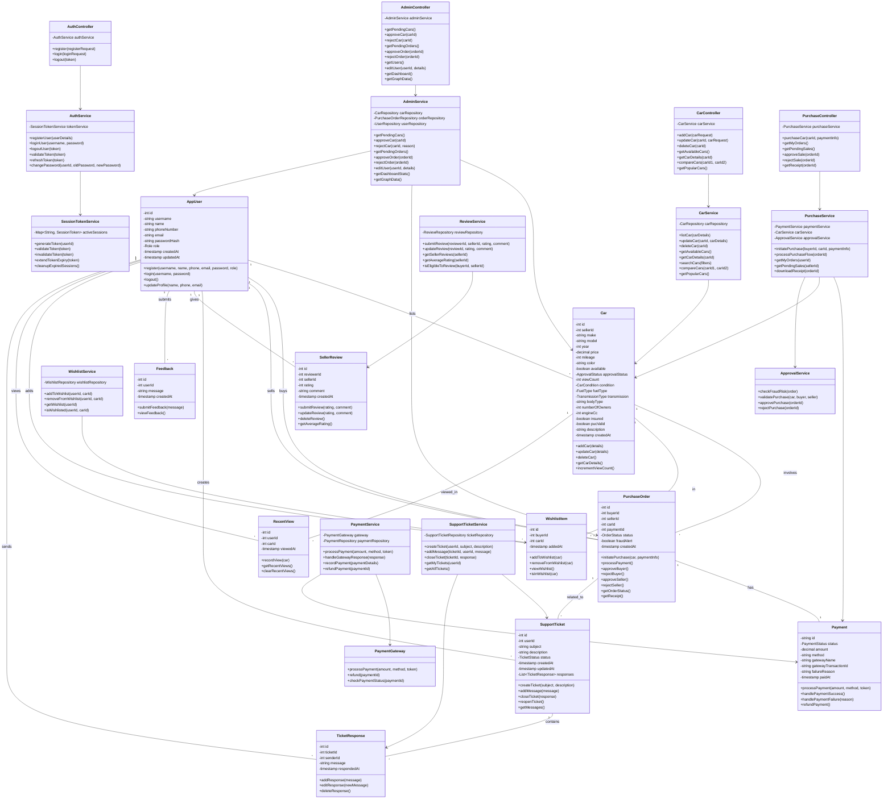
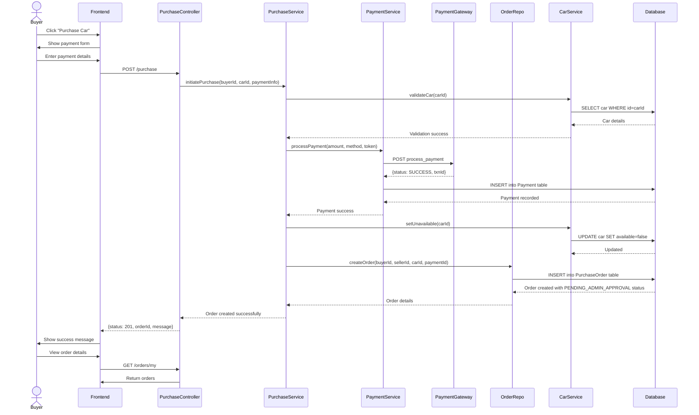
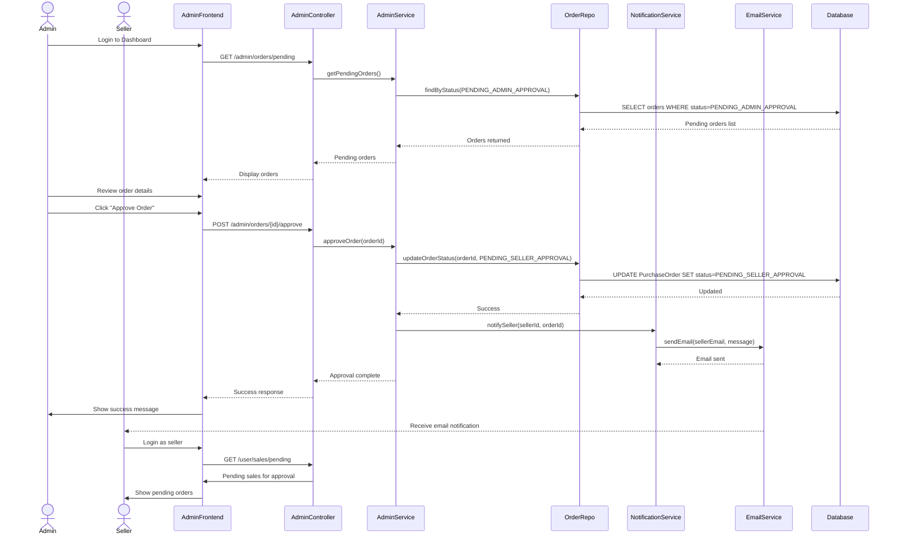
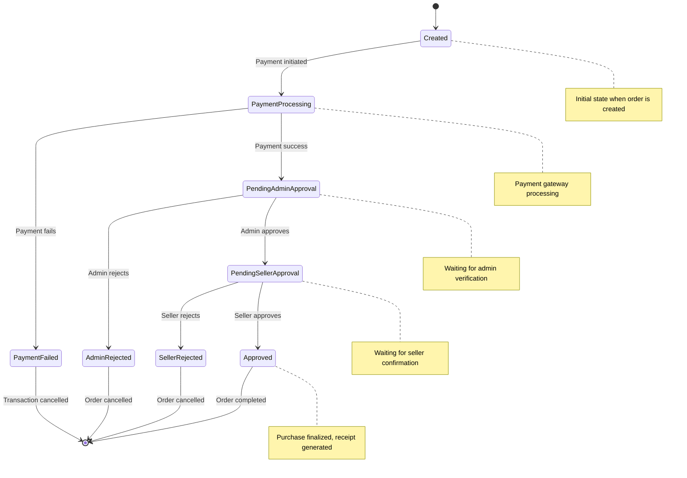
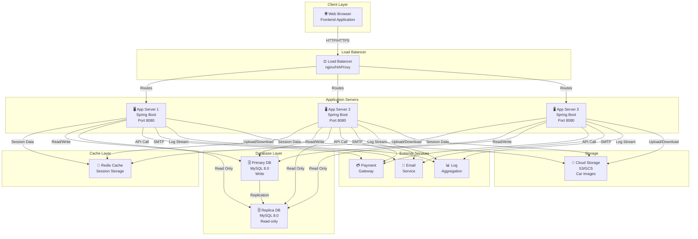

# TrustLot System - UML Diagrams

## 1. UML Class Diagram - Complete System



---

## 2. UML Sequence Diagram - Car Purchase Flow



---

## 3. UML Sequence Diagram - Admin Approval Flow



---

## 4. UML State Diagram - Purchase Order States



---

## 5. UML Use Case Diagram - Buyer Features

```mermaid
usecase UC1 as "Browse Cars"
usecase UC2 as "Search/Filter Cars"
usecase UC3 as "Compare Cars"
usecase UC4 as "View Car Details"
usecase UC5 as "Add to Wishlist"
usecase UC6 as "Remove from Wishlist"
usecase UC7 as "View Recent Searches"
usecase UC8 as "Purchase Car"
usecase UC9 as "Make Payment"
usecase UC10 as "View My Orders"
usecase UC11 as "Download Receipt"
usecase UC12 as "Rate Seller"
usecase UC13 as "Submit Review"
usecase UC14 as "Create Support Ticket"
usecase UC15 as "Message Support"
usecase UC16 as "View Support History"
usecase UC17 as "Submit Feedback"

actor Buyer as "Buyer/User"

Buyer --> UC1
Buyer --> UC2
Buyer --> UC3
Buyer --> UC4
Buyer --> UC5
Buyer --> UC6
Buyer --> UC7
Buyer --> UC8
Buyer --> UC9
Buyer --> UC10
Buyer --> UC11
Buyer --> UC12
Buyer --> UC13
Buyer --> UC14
Buyer --> UC15
Buyer --> UC16
Buyer --> UC17

UC8 .> UC9 : includes
UC8 .> UC11 : includes
UC12 .> UC13 : includes
UC14 .> UC15 : includes
```

---

## 6. UML Use Case Diagram - Seller Features

```mermaid
usecase UC1 as "List Car for Sale"
usecase UC2 as "Edit Car Listing"
usecase UC3 as "Delete Car Listing"
usecase UC4 as "View My Listings"
usecase UC5 as "View Listing Status"
usecase UC6 as "Wait for Admin Approval"
usecase UC7 as "Respond to Purchase"
usecase UC8 as "Approve Sale"
usecase UC9 as "Reject Sale"
usecase UC10 as "View Sales History"
usecase UC11 as "Download Receipt"
usecase UC12 as "View Seller Rating"
usecase UC13 as "Create Support Ticket"
usecase UC14 as "Message Support"

actor Seller as "Seller/User"

Seller --> UC1
Seller --> UC2
Seller --> UC3
Seller --> UC4
Seller --> UC5
Seller --> UC6
Seller --> UC7
Seller --> UC8
Seller --> UC9
Seller --> UC10
Seller --> UC11
Seller --> UC12
Seller --> UC13
Seller --> UC14

UC1 .> UC6 : includes
UC7 .> UC8 : includes
UC7 .> UC9 : includes
UC8 .> UC11 : includes
```

---

## 7. UML Use Case Diagram - Admin Features

```mermaid
usecase UC1 as "View Dashboard"
usecase UC2 as "View Analytics"
usecase UC3 as "View Pending Cars"
usecase UC4 as "Approve Car Listing"
usecase UC5 as "Reject Car Listing"
usecase UC6 as "View All Orders"
usecase UC7 as "View Pending Orders"
usecase UC8 as "Approve Order"
usecase UC9 as "Reject Order"
usecase UC10 as "View All Users"
usecase UC11 as "Edit User Details"
usecase UC12 as "Reset User Password"
usecase UC13 as "View Support Tickets"
usecase UC14 as "Respond to Ticket"
usecase UC15 as "Close Ticket"
usecase UC16 as "View Feedback"
usecase UC17 as "Download Receipt"

actor Admin as "Admin/Moderator"

Admin --> UC1
Admin --> UC2
Admin --> UC3
Admin --> UC4
Admin --> UC5
Admin --> UC6
Admin --> UC7
Admin --> UC8
Admin --> UC9
Admin --> UC10
Admin --> UC11
Admin --> UC12
Admin --> UC13
Admin --> UC14
Admin --> UC15
Admin --> UC16
Admin --> UC17

UC1 .> UC2 : includes
UC3 .> UC4 : includes
UC3 .> UC5 : includes
UC7 .> UC8 : includes
UC7 .> UC9 : includes
UC13 .> UC14 : includes
UC13 .> UC15 : includes
```

---

## 8. UML Activity Diagram - Car Listing Process

```mermaid
activity
    start
    :User fills car listing form;
    :Select make, model, year, price;
    :Add condition, fuel type, transmission;
    :Enter mileage, number of owners;
    :Write description;
    if (All fields valid?) then
        :Submit listing;
        :System validates data;
        if (Validation passed?) then
            :Store in database;
            :Set status to PENDING_ADMIN_APPROVAL;
            :Notify user of submission;
            :Send email confirmation;
        else
            :Show validation errors;
            :User corrects data;
            note right : Return to form
        endif
    else
        :Show validation errors;
        :User corrects data;
        note right : Return to form
    endif
    
    :Admin reviews listing;
    if (Listing acceptable?) then
        :Admin approves;
        :Update status to APPROVED;
        :Set available to true;
        :Car appears in search;
        :Notify seller;
    else
        :Admin rejects;
        :Update status to REJECTED;
        :Send rejection reason;
        :Notify seller;
    endif
    
    stop
```

---

## 9. UML Activity Diagram - Purchase Order Processing

```mermaid
activity
    start
    :Buyer selects car;
    :Clicks Purchase button;
    :Reviews car details & price;
    :Enters payment information;
    :Submits purchase;
    
    :System validates purchase eligibility;
    if (Can purchase?) then
        :Check car available;
        if (Car available?) then
            :Process payment;
            if (Payment successful?) then
                :Mark car unavailable;
                :Create purchase order;
                :Set status PENDING_ADMIN_APPROVAL;
                :Notify buyer & seller;
            else
                :Show payment error;
                :Refund any partial charges;
                :End transaction;
            endif
        else
            :Show car unavailable;
            :End transaction;
        endif
    else
        :Show eligibility error;
        :End transaction;
    endif
    
    :Admin reviews order;
    if (Admin approves?) then
        :Update status PENDING_SELLER_APPROVAL;
        :Notify seller;
        
        :Seller reviews order;
        if (Seller approves?) then
            :Update status APPROVED;
            :Mark car as sold;
            :Generate receipt;
            :Send confirmation emails;
        else
            :Seller rejects;
            :Update status REJECTED;
            :Refund buyer;
        endif
    else
        :Admin rejects;
        :Update status REJECTED;
        :Refund buyer;
    endif
    
    stop
```

---

## 10. UML Deployment Diagram



---

## Diagram Summary

| Diagram | Purpose | Key Focus |
|---------|---------|-----------|
| **Class Diagram** | System design | Entities, services, controllers, relationships |
| **Sequence: Purchase** | Purchase flow | Interactions between components in purchase |
| **Sequence: Approval** | Approval flow | Admin and seller approval interactions |
| **State Diagram** | Order lifecycle | State transitions during purchase |
| **Use Case: Buyer** | Buyer capabilities | All buyer features and interactions |
| **Use Case: Seller** | Seller capabilities | All seller features and interactions |
| **Use Case: Admin** | Admin capabilities | All admin features and interactions |
| **Activity: Listing** | Car listing process | Steps in listing a car |
| **Activity: Purchase** | Purchase process | Steps in purchasing a car |
| **Deployment** | System architecture | Server, database, cache, external services |

---

## How to Use These Diagrams

1. **Class Diagram:** Use for understanding system structure and object relationships
2. **Sequence Diagrams:** Use for understanding message flow and timing of operations
3. **State Diagrams:** Use for understanding lifecycle of business entities
4. **Use Case Diagrams:** Use for identifying user interactions and system boundaries
5. **Activity Diagrams:** Use for process documentation and workflow understanding
6. **Deployment Diagram:** Use for understanding production infrastructure and deployment architecture

All diagrams are rendered using Mermaid syntax and are compatible with GitHub, GitLab, and other Markdown renderers that support Mermaid.
