# Angular Frontend — Architecture Diagrams

---

## 1. Application Bootstrap Flow

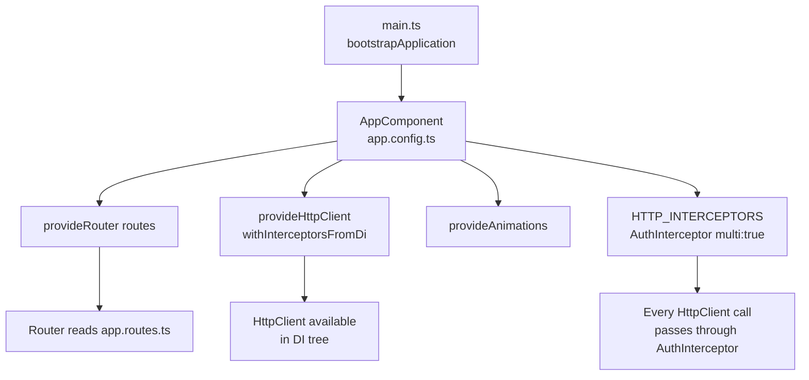

---

## 2. Full Route Hierarchy & Guards

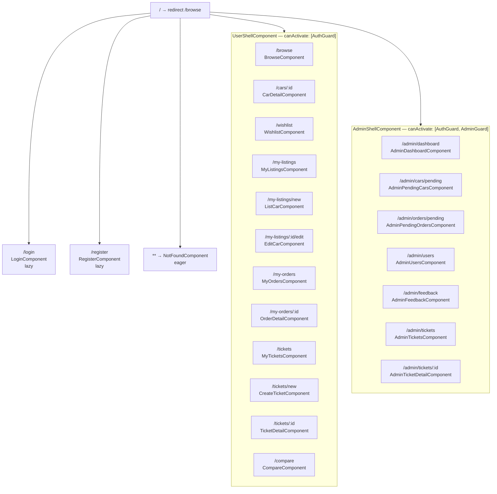

---

## 3. Route Guard Decision Flow

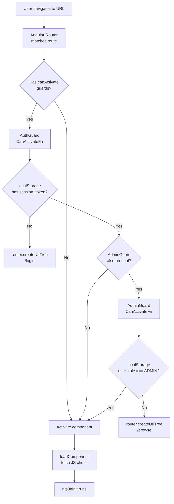

---

## 4. HTTP Interceptor Flow

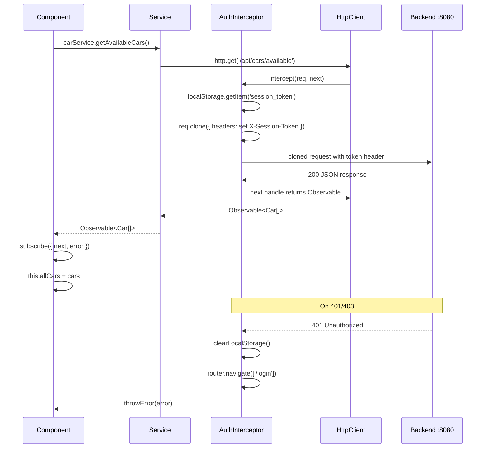

---

## 5. Login → Auth State → Navigation Flow

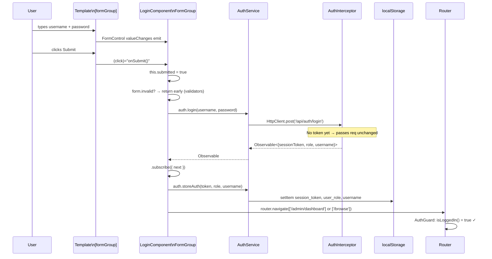

---

## 6. Component Lifecycle — BrowseComponent Data Flow

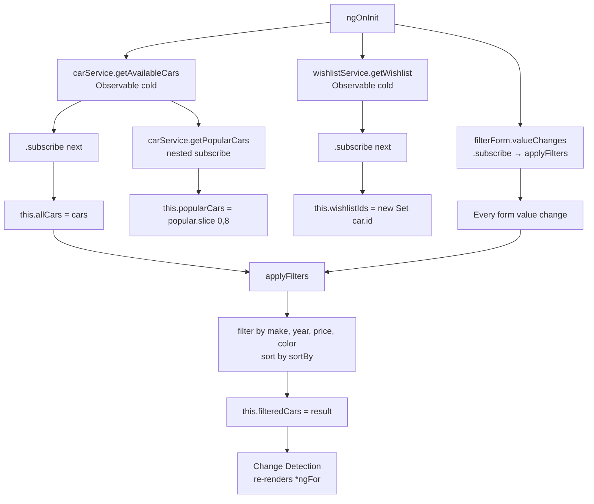

---

## 7. Purchase Dialog — Multi-Step Flow

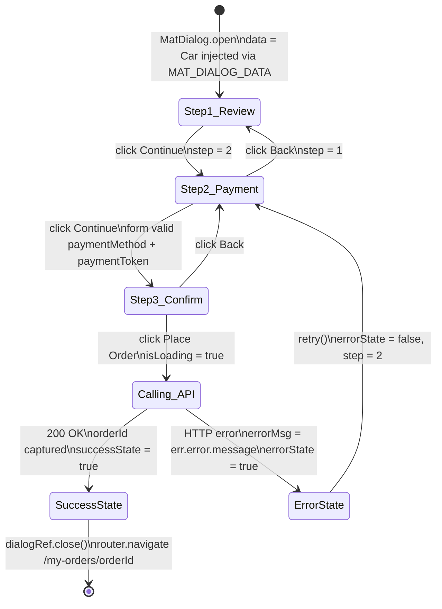

---

## 8. BehaviorSubject — CompareService Reactive State

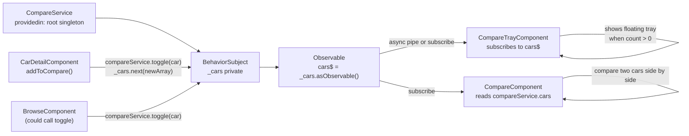

---

## 9. Service Layer — Full Domain Map

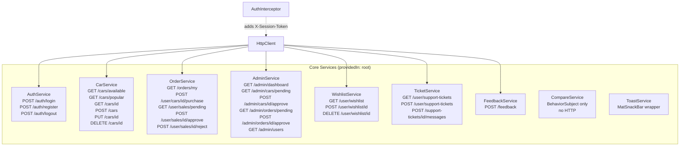

---

## 10. Standalone Component Import Model

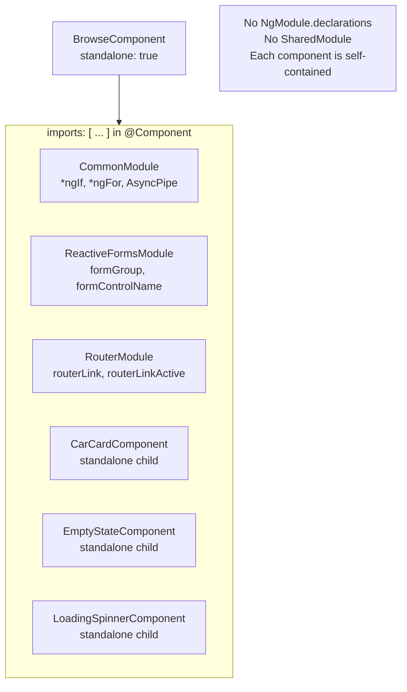

---

## 11. Complete E2E Data Flow — One Page Summary

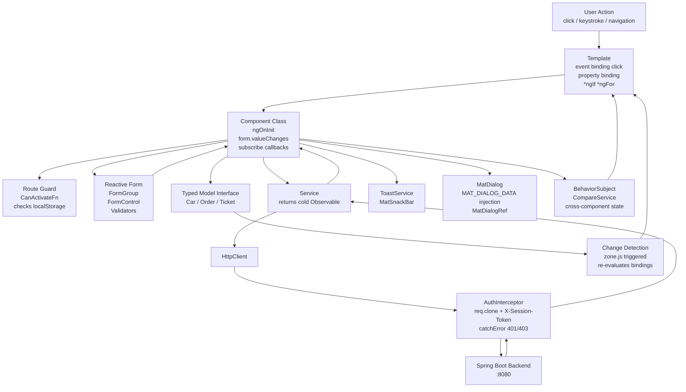
